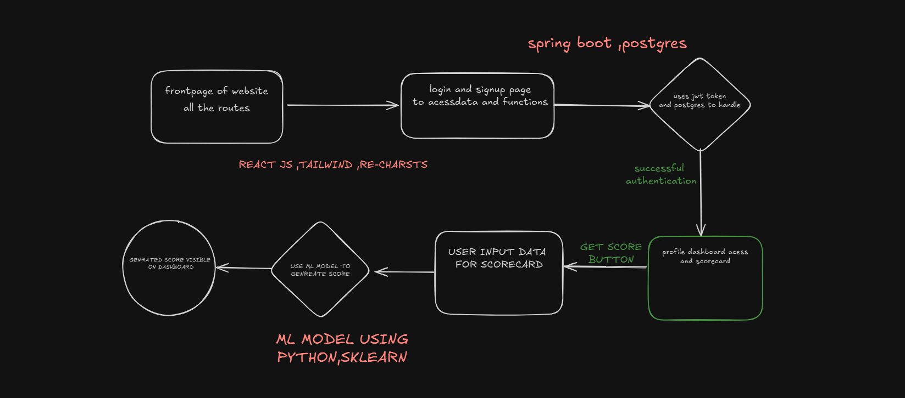

# AthLead

AthLead is a **full-stack sports analytics application** that combines a modern React frontend, a secure Spring Boot backend, and a machine learning model built with Python.  

The main goal of this project is to allow users (athletes or coaches) to **register, log in securely, input performance data, and generate a performance score** using a trained ML model. The generated scores are displayed visually on the **Dashboard** for better analysis.

---

## ✨ Features

- 🔐 **JWT Authentication** – Secure login & signup flow
- 📊 **Dashboard Access** – Only authenticated users can view their profile & scorecards
- ⚡ **Score Generation** – User inputs performance data, ML model generates a score
- 📈 **Data Visualization** – Score is displayed as a line chart using Recharts
- 🖥️ **Full-Stack Integration** – React (frontend) + Spring Boot (backend) + Python ML model

---

## 📂 Project Structure

## 📂 Project Structure
- `AthLead-frontend/` → React frontend (Vite + Tailwind)
- `AthLead-ML-model/` → Machine Learning models + API (Python, Flask/FastAPI)
- `AthLead-JWT-Springboot/` → Spring Boot backend with JWT authentication

## 🖼️ Architecture/Workflow



---
 


### 🔹 1. Frontend – React + Tailwind + Recharts

The frontend is built using **React (Vite)** and styled with **Tailwind CSS**. It provides the user interface with navigation, authentication pages, and the dashboard.

#### 🛠️ Features:
- Homepage with all routes
- Login & Signup pages
- Dashboard page with score visualization (Recharts)
- Responsive design with Tailwind

#### ▶️ Run Frontend
```bash
cd AthLead-frontend
npm install
npm run dev


### 📁 'AthLead-JWT-Springboot/README.md'

```markdown
# AthLead Backend (Spring Boot + JWT + PostgreSQL)

This is the **Spring Boot backend** of the AthLead project.  
It handles **user authentication and authorization** with JWT and persists user data in a **PostgreSQL** database.

open this in intellij by opening folder 

---

## ✨ Features
- JWT-based authentication (signup & login)
- PostgreSQL integration
- REST API for frontend communication
- Secure access control (dashboard available only after login)

---

open this in intellij by opening folder and run the **JWTImplementationApplication** .


### 📁 `AthLead-ML-model/README.md`

```markdown
# AthLead ML Model (Python + scikit-learn)

This is the **machine learning model** of the AthLead project.  
It generates a **performance score** from user input data and exposes it via a REST API.

---

## ✨ Features
- Trained with scikit-learn.
- Flask/FastAPI REST endpoint for predictions.
- Accepts input data from frontend and returns score.
- Integrated with dashboard for visualization.

---

## ▶️ Run ML Model

```bash
cd AthLead-ML-model

```
```bash

# # Activate virtual environment
# venv\Scripts\activate    # On Windows

# ```

```bash
# Install dependencies
pip install -r requirements.txt
```

```bash
# Run the API
 uvicorn api:app --reload    
 ```