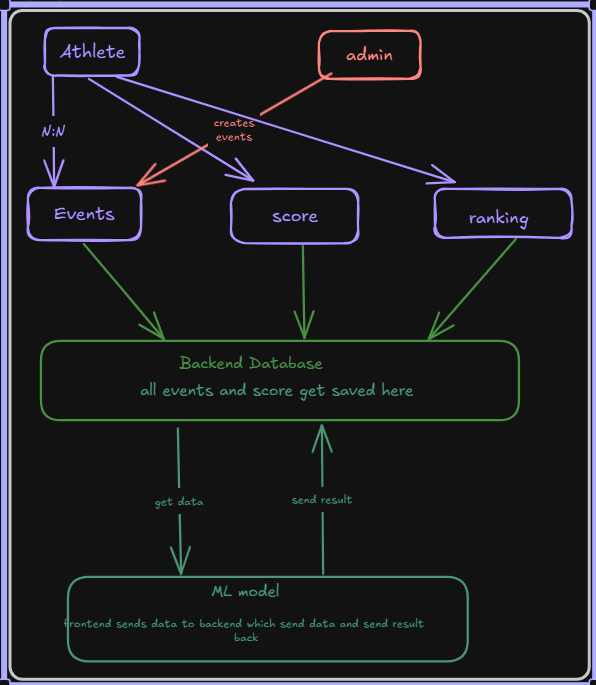

# AthLead


***Athlead is an AI-powered sports talent discovery & ranking platform built for SIH 2025 — Ministry of Youth Affairs & Sports, Government of India***

*The main goal of this project is to allow users (athletes or coaches) to **register, log in securely, input performance data, and generate a performance score** using a trained ML model. The generated scores are displayed visually on the **Dashboard** for better analysis.*

---
### Architecture



**LINK :-** https://athlead-frontend.onrender.com/

---
## FEATURES

- **AI Player Judging**
- 📊 **ML Score Dashboard** 
- 🏅 **National Rankings** 
- 📅 **Event Management**  
- 📰 **Announcements** - Ministry policy updates, news, and recruitment alerts 
- 🔐 **Auth System** Role - based access for Athletes, Coaches, Scouts, and Admins 
- 📱 **Responsive UI** 
---
## 🛠️ Tech Stack 

### Frontend

- **React js (VITE)**
- **Tailwind css**
- **Lucide reacts**
- **Recharts**
- **Axios**
- **dayjs**

### Backend

- **NODE JS & Express**
- **MongoDB & Mongoose**
- **JWT** — Authentication & authorization
- **Passport JS**
- **Cloudinary &  Multer**
- **BCRYPT**

### ML / AI *(planned integration)* 

- **Python + FastAPI** — ML inference microservice 
- **OpenCV + MediaPipe** — Pose estimation & biomechanics 
- **TensorFlow / PyTorch** — Performance scoring model

---
## 📁 Project Structure

```
project-root/
├── frontend/
├── backend/
├── ml/
├── .env
├── README.md
└── vercel.json
```

```
frontend/
└── src/
    ├── pages/
    │   ├── Home.jsx
    │   ├── Events.jsx
    │   ├── Dashboard.jsx
    │   ├── Login.jsx
    │   └── Signup.jsx
    │
    ├── components/
    │
    ├── context/
    │   ├── AppProvider.jsx
    │   ├── IsLoggedIn.jsx
    │   └── ProtectedRoute.jsx
    │
    ├── api/ (API calls here)
    │
    ├── App.jsx
    └── main.jsx
```

```
backend/
├── config/
│   ├── db.js
│   └── passport-config.js
│
├── controllers/
│   ├── authController.js
│   ├── eventController.js
│   ├── newsController.js
│   └── scoreController.js
│
├── models/
│   ├── Users.js
│   ├── Event.js
│   └── Score.js
│
├── routes/
│   ├── userRoutes.js
│   └── eventRoutes.js
│
├── middleware/
│
├── utils/
│
├── uploads/
│
└── index.js
```

```
ml/
├── data/
├── models/
├── api.py
├── train_model.py
└── requirements.txt
```
*** 
## 🤝 Contributing 

*This project was built for **Smart India Hackathon 2025**. Contributions, suggestions, and issue reports are welcome.*

```
bash # Fork → clone → create branch → push → open PR git checkout -b feature/your-feature-name 
```

---
### Author
- *Aarsh-HV*
- **ML model- [DEV M](https://github.com/dev-m03)**
---
             


