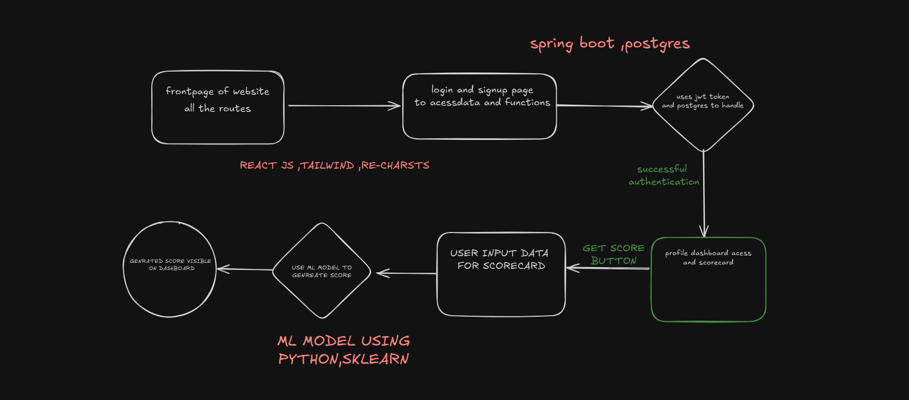

# AthLead

AthLead is a **full-stack sports analytics application** that combines a modern React frontend, a secure Spring Boot backend, and a machine learning model built with Python.  

*The main goal of this project is to allow users (athletes or coaches) to **register, log in securely, input performance data, and generate a performance score** using a trained ML model. The generated scores are displayed visually on the **Dashboard** for better analysis.*


## 🖼️ Architecture/Workflow




## NOTES:-

#### CLSX
- *Used for conditional classname in react or typeScript*
- *It allows to put conditional css tailwind using this tool use useLocation and use pathname for each location*

```jsx
import { cn } from "../utility/cn";

const location = useLocation();
const pathname = location.pathname;

<nav className={cn("w-full h-18 flex items-center justify-between b-0 t-0 z-1 border-b border-gray-50/8", pathname == "/" && "absolute",)}>
```